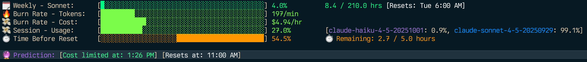

# CCU - Claude Code Usage Monitor

A performant terminal dashboard for monitoring Claude Code usage, built in Go using the Charm family of packages (Bubbletea, Lipgloss, Bubbles).



## Features

- **Live Claude API Usage Data** - Near real-time usage stats from Anthropic's servers with exact reset times
- **5-Hour Session Tracking**: Monitor rolling 5-hour usage windows with OAuth utilisation percentage
- **Weekly Limits**: Track 7-day rolling usage for Sonnet and Opus models separately
- **Real-time Dashboard**: Live updating terminal UI with colour-coded progress bars
- **Burn Rate Monitoring**: Dual burn rate display - tokens/minute and cost/hour with visual indicators
- **Intelligent Predictions**: Cost depletion time with colour-coded warnings (red if before reset, orange if close, green if safe)
- **Plan Support**: Pro, Max5, Max20
- **Automatic Fallback**: Uses OAuth when available, falls back to local JSONL parsing
- **Model Distribution**: See which models you're using per session (Sonnet, Opus, Haiku)

## Installation

### From Source

```bash
git clone <repository>
cd ccu
make build
./bin/ccu
```

### Using Go Install

```bash
go install ./cmd/ccu
```

## Usage

### Basic Usage

```bash
# Run with default settings (Max5 plan)
ccu

# Use a different plan
ccu -plan=pro
ccu -plan=max20

# Custom plan with specific limits
ccu -plan=custom -custom-tokens=50000 -custom-cost=25 -custom-messages=500

# Interactive view modes (TUI)
ccu -view=daily    # Daily aggregation
ccu -view=monthly  # Monthly aggregation

# Static reports (stdout, no TUI)
ccu -report=monthly              # Monthly usage report
ccu -report=daily                # Daily usage report (last 30 days)
ccu -report=daily -hours=90      # Last 90 days

# Adjust refresh rate (1-60 seconds, default: 5)
ccu -refresh=10

# Load more history (for JSONL fallback mode)
ccu -hours=48      # Last 48 hours
```

### Command-Line Flags

- `-plan` - Plan type: `pro`, `max5`, `max20`, `custom` (default: `max5`)
- `-view` - View mode: `realtime`, `daily`, `monthly` (default: `realtime`)
- `-report` - Generate static report to stdout: `daily`, `monthly` (bypasses TUI)
- `-refresh` - UI refresh rate in seconds, 1-60 (default: `5`). Note: OAuth data is cached for 60 seconds regardless of UI refresh rate
- `-hours` - Hours of history to load from JSONL files (default: `24`, only used in fallback mode)
- `-data` - Path to Claude data directory (default: `~/.claude/projects`, only used in fallback mode)
- `-custom-tokens` - Custom token limit (requires `-plan=custom`)
- `-custom-cost` - Custom cost limit in USD (requires `-plan=custom`)
- `-custom-messages` - Custom message limit (requires `-plan=custom`)
- `-weekly` - Show weekly usage panel (default: `true`)
- `-help` - Show help message
- `-version` - Show version information

### Keyboard Controls

- `q` or `Ctrl-C` - Exit the application

## How It Works

### Data Sources

CCU uses **two data sources** for maximum accuracy:

#### 1. OAuth API (Primary - Requires Re-authentication)

CCU automatically fetches live usage data from Anthropic's servers when available:
- **Exact reset times** for 5-hour sessions and 7-day windows
- **Combined web + CLI usage** tracking

To enable OAuth you may need to re-authenticate Claude Code to get tokens with the required scopes:
```bash
claude logout
claude login
```

After re-authentication, CCU will automatically use OAuth data when available.

#### 2. Local JSONL Files (Fallback)

If OAuth is unavailable, CCU reads from `~/.claude/projects/**/*.jsonl` files:
- Token counts (input, output, cache creation, cache read)
- Model information
- Timestamps
- Cost data

**Limitation**: JSONL files only contain CLI activity, not web browser usage from claude.ai.

### OAuth vs JSONL

| Feature              | OAuth API    | JSONL Files |
|----------------------|--------------|-------------|
| Web + CLI tracking   | ✅ Yes        | ❌ CLI only  |
| Exact reset times    | ✅ Yes        | ⚠️ Estimated |
| Separate model usage | ✅ Yes        | ✅ Yes       |
| Setup required       | Re-auth once | None        |

### Session Blocks

Usage is grouped into 5-hour rolling session blocks. Each session tracks:
- Total tokens consumed
- Cost accumulated
- Messages sent
- Per-model statistics
- Burn rate (tokens/minute)

### Burn Rate Calculation

Burn rates are calculated using a proportional overlapping session method over the last hour:
- For each session overlapping the last 60 minutes, calculate the overlap duration
- Apply proportion of session's tokens/cost based on overlap
- Prevents double-counting when sessions overlap
- Displayed as: tokens/minute and dollars/hour

**Visual Indicators**: Burn rate bars use green→yellow→orange→red gradient based on intensity (percentage of limit at current rate).

### Predictions

The tool provides intelligent cost depletion predictions:
- **Cost Depletion Time**: When you'll hit the cost limit based on current burn rate (calculated from last hour)
- **Session Reset Time**: When the 5-hour window expires (from OAuth or estimated)

**Colour-Coded Warnings**:
- 🔴 **Red**: Depletion time is BEFORE reset (you'll be cut off)
- 🟠 **Orange**: Depletion time is within 30 minutes AFTER reset (close call - usage spike could cut you off)
- 🟢 **Green**: Depletion time is 30+ minutes after reset (safe)

Cost-based predictions are more accurate than token-based for mixed-model usage because different models have different costs per token.

### Weekly Tracking

Weekly limits are tracked over a rolling 7-day window:
- Separates Sonnet and Opus usage
- Converts tokens to estimated hours (Sonnet: ~5k tokens/hour, Opus: ~3k tokens/hour)
- Displays progress against plan limits

## Plan Limits

As of 2025-12-01

### Pro Plan
- Cost: $18 per 5-hour session
- Messages: ~250 per 5-hour session (estimated)
- Weekly: ~60 hours Sonnet

### Max5 Plan
- Cost: $35 per 5-hour session
- Messages: ~1,000 per 5-hour session (estimated)
- Weekly: ~210 hours Sonnet, ~25 hours Opus

### Max20 Plan
- Cost: $140 per 5-hour session
- Messages: ~2,000 per 5-hour session (estimated)
- Weekly: ~360 hours Sonnet, ~32 hours Opus

## Customisation

### Colours

All colours and their mappings are centralised in `internal/ui/styles.go` (lines 9-127):

- **Colour definitions**: Edit hex values for model colours (Sonnet/Opus/Haiku), UI elements, and gradients
- **Element mappings**: Documentation showing which UI element uses which colour (weekly bars, burn rates, session usage, time remaining, predictions)

To customise colours:
1. Edit `internal/ui/styles.go`
2. Find your element in the mappings section (lines 92-127)
3. Change the corresponding colour value (lines 16-90)
4. Run `make build`

### Project Structure

```
ccu/
├── cmd/ccu/          # Entry point
├── internal/
│   ├── app/          # Bubbletea application (MVU pattern)
│   ├── oauth/        # OAuth client for Anthropic API
│   ├── data/         # JSONL reading and parsing (fallback)
│   ├── analysis/     # Session blocks, burn rate, predictions
│   ├── models/       # Data structures
│   ├── pricing/      # Model pricing calculations
│   ├── ui/           # Dashboard rendering and colour logic
│   └── config/       # Configuration management
└── Makefile
```

## Licence

- [Apache 2.0](LICENSE)
